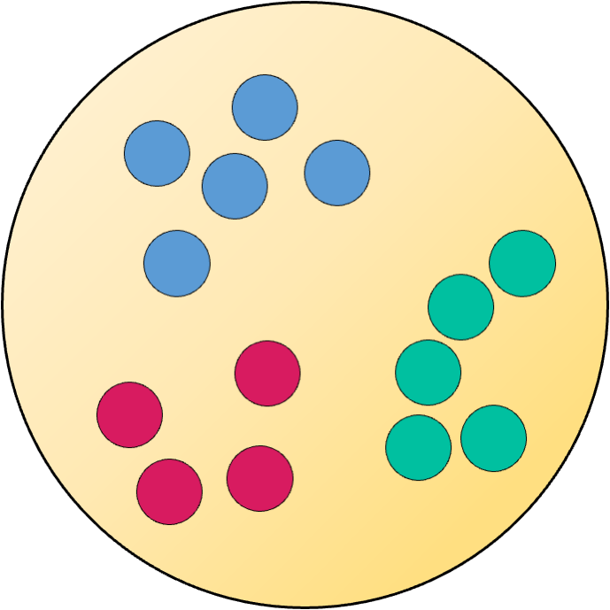
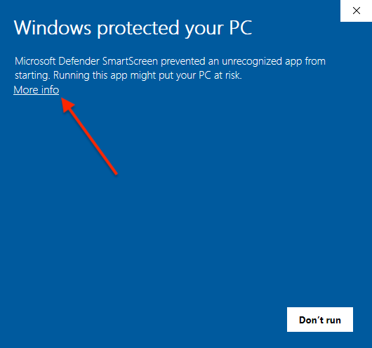
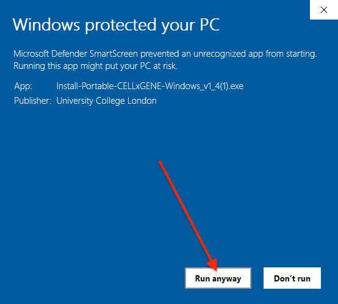

#  Portable-CELLxGENE

Portable-CELLxGENE is an executable version of
[CELLxGENE](https://github.com/chanzuckerberg/cellxgene) and
[CELLxGENE-gateway](https://github.com/Novartis/cellxgene-gateway) to allow
single-cell transcriptomic data to be annotated using without using the command
line or installing extra software.

## Installation

### MacOS

1. If your computer has an Apple M-series chip, download the installer from
   [here](https://github.com/george-hall-ucl/portable-cellxgene/releases/latest/download/Install-Portable-CELLxGENE-MacOS-apple-silicon.dmg).
   If it has an intel chip, download the installer from
   [here](https://github.com/george-hall-ucl/portable-cellxgene/releases/latest/download/Install-Portable-CELLxGENE-MacOS-intel.dmg).
   (to determine whether your Mac has an Apple M-series chip or an intel chip,
   click the Apple logo in the top left corner of your screen, go to "About
   This Mac" and look under "Chip").
2. Double click on the downloaded file to open it.
3. Drag the app's icon into the `Applications` folder.
4. Portable-CELLxGENE can now be run like any other program.

<details>
<summary>Click to reveal video of installation process</summary>
<kbd></kbd>
</details>

### Windows

1. Download the installation program from
   [here](https://github.com/george-hall-ucl/portable-cellxgene/releases/download/v1.4/Install-Portable-CELLxGENE-Windows_v1_4.exe).
2. Double click on the downloaded file to run it. It should download and
   install Portable-CELLxGENE.

Since the software is new, Windows Defender SmartScreen may try to block its
execution. If this happens, you will see a pop-up saying "Windows protected
your PC". Click `More info` and then `Run anyway`. You should only need to do
this once for the installer and once for the program itself.

<details>
<summary>Click to reveal images showing how to bypass SmartScreen</summary>
    <center>
    <kbd></kbd>
    <kbd></kbd>
    </center>
</details>

## Running Portable-CELLxGENE

<details>
<summary>Click to reveal video of basic Portable-CELLxGENE usage</summary>
Recorded in MacOS, but the process is similar in Windows.
<kbd></kbd>
</details>

1. A file browser will open. Navigate to the folder containing your `.h5ad` and
   click "Open".
2. A page listing the datasets should open in your browser. If it does not open
   after a minute, then navigate to
   [http://127.0.0.1:5005/portable_home.html](http://127.0.0.1:5005/portable_home.html)
   yourself. If the page opened automatically but is not displaying anything,
   then you may need to refresh it.
3. Follow the instructions on the homepage.
4. Once you are finished, close the CELLxGENE browser tab(s) and quit the
   app.

Note: Each annotation session will continue running in the background until
either the Portable-CELLxGENE app is terminated or the session is closed from
the "View running sessions" page (see end of above video). For large datasets,
this may slow down your computer so it is advisable to terminate them once you
are finished.

## Distributing your data

To distribute your data using this app, simply create a folder containing
`.h5ad` files of the datasets of interest. Rendered notebooks can be made
accessible to the user by storing them in a folder named `rendered_notebooks`.
The recipient needs to download the Portable-CELLxGENE app and run it using the
above guide.

### Converting Seurat objects to `.h5ad` files

By default, the `.h5ad` files created by the standard Seurat -> Anndata
conversion process (detailed
[here](https://mojaveazure.github.io/seurat-disk/articles/convert-anndata.html))
contain only the highly variable genes, and therefore other genes cannot be
annotated in `CELLxGENE`. This can be fixed by replacing the data stored in the
`scale.data` slot of the Seurat object with the entire gene expression matrix.
This object can then be converted to a `.h5ad` file using the process detailed
in the link above. Putting this together:

```{r}
# For each Seurat object you want to include in Portable-CELLxGENE:
# Assume Seurat object is called "cells"
library(Seurat)
library(SeuratDisk)
cells@assays$RNA@scale.data <- as.matrix(GetAssayData(cells))
SaveH5Seurat(object = cells, filename = "cells.h5Seurat")
Convert(source = "cells.h5Seurat", dest = "h5ad")
```

## How to use CELLxGENE

There are many guides on how to use CELLxGENE available online, for example a
basic introduction can be found
[here](https://icbi-lab.github.io/cellxgene-user-guide/). The official
documentation of CELLxGENE is
[here](https://cellxgene.cziscience.com/docs/01__CellxGene), which gives
in-depth information on its use.

## Uninstallation

### MacOS

Navigate to the `Applications` folder in Finder and delete Portable-CELLxGENE.

### Windows

1. Open the command prompt (Windows key + "R", then type `cmd` and hit enter).
2. Copy the following into the command prompt and hit enter.

```
rmdir /q /s "%LOCALAPPDATA%\Portable-CELLxGENE"
del "%HOMEPATH%\Desktop\Portable-CELLxGENE.lnk"
del "%APPDATA%\Microsoft\Windows\Start Menu\Programs\Portable-CELLxGENE.lnk"
```

## Contributing guidelines

You can contribute to Portable-CELLxGENE by submitting a
[pull request](https://github.com/george-hall-ucl/portable-cellxgene/pulls).
Before spending time working on a contribution, you should check whether anyone
else has submitted an
[issue](https://github.com/george-hall-ucl/portable-cellxgene/issues)
and is working on the same thing.

All contributors are expected to adhere to our
[Code of Conduct](CODE_OF_CONDUCT.md).

## Building and Releasing

### MacOS

#### Building

To test modifications to Portable-CELLxGENE, it is sufficient to run the build
script and not codesign the output. We need to pass the script the paths to
the:

* conda environment that will be bundled with the software (use the one in `Portable-CELLxGENE.app/Contents/Resources/pcxg_conda_env_MacOS`)
* `.icns` file for the app's icon
* `launch_cellxgene.sh`

```console
sh build_pcxg_MacOS.sh ./path/to/conda/environment ./path/to/app_icon.icns ./path/to/launch_cellxgene.sh
```

The build process will output:

* A `.app` directory containing the application.
* A directory containing a copy of the conda environment that will be bundled
  with the software.
* A `.tar.gz` compressed archive of the conda environment directory.
* A copy of the `launch_cellxgene.sh` script.

#### Signing

The output of the build process can be signed with the signing script. This
only needs to be done for a release of the software: it is not necessary when
building Portable-CELLxGENE for testing purposes.

The signing script should be run in the directory containing the outputs of the
build script. it requires the name of an app-specific password for `notarytool`
and the name of the Developer ID Application certificate that you want to use.

```console
sh sign_pcxg_MacOS.sh ./path/to/dmg_background.png "name of app-specific password for notarytool" "Developer ID Application: Team Name (Team ID)"
```

The signing script will output a `.dmg` disk image that has been signed and
notarized to allow easy installation.

#### Releasing

The release script runs the build and signing scripts consecutively.

```console
sh release_pcxg_MacOS.sh \
    ./path/to/conda/environment \
    ./path/to/app_icon.icns \
    ./path/to/launch_cellxgene.sh \
    ./path/to/dmg_background.png \
    "name of app-specific password for notarytool" \
    "Developer ID Application: Team Name (Team ID)"
```

The release script will store its outputs in a new directory called
`Portable_CELLxGENE_Build_Dir_` appended with a timestamp of when the script
was executed. This will contain the `.app` and `.dmg` generated by the above
scripts.

### Windows

1. Download and extract the latest pack of build assets from
   [here](https://github.com/george-hall-ucl/Portable-CELLxGENE-assets/releases/download/v1.4/windows_build_assets.zip). Once extracted, the folder should contain two directories:

    ```
    windows_build_assets
    ├── app
    │   ├── Portable-CELLxGENE.bat
    │   └── favicon.ico
    └── install
        ├── Install-Portable-CELLxGENE-Windows.ps1
        └── installer_favicon.ico
    ```
2. Download and extract the latest Windows conda environment from
   [here](https://github.com/george-hall-ucl/Portable-CELLxGENE-assets/releases/download/v1.4/pcxg_1_3_windows.zip).
3.  Build the app's `.exe`. To do this, compile `Portable-CELLxGENE.bat` into a
    `.exe` using the `bat2exe` tool. You should be able just to point this tool
    to the `windows_build_assets\app` directory and it will take care of the
    rest.
4. Sign the `.exe` produced in the previous step using signtool.
   `signtool sign /tr http://timestamp.sectigo.com /td sha256 /fd sha256 /a Portable-CELLxGENE-Windows.exe`
5. Zip together the signed `.exe` and the conda environment from Step 2 and
   upload to the assets repo.
6. Build the installer using the `ps2exe` tool in PowerShell. Sign the `.exe`
   it outputs. Note that you may need to update the download path used by the
   script to point to the new bundle created in Step 5.
   `ps2exe -inputFile .\Install-Portable-CELLxGENE-Windows.ps1 -iconFile .\installer_favicon.ico -noConsole -exitOnCancel`
   `signtool sign /tr http://timestamp.sectigo.com /td sha256 /fd sha256 /a Install-Portable-CELLxGENE-Windows.exe`
7. Upload the installer `.exe` to the main github repo.

## Licensing

Copyright (C) 2023-2024 University College London

This program is free software: you can redistribute it and/or modify
it under the terms of the GNU General Public License as published by
the Free Software Foundation, either version 3 of the License, or
(at your option) any later version.

This program is distributed in the hope that it will be useful,
but WITHOUT ANY WARRANTY; without even the implied warranty of
MERCHANTABILITY or FITNESS FOR A PARTICULAR PURPOSE.  See the
GNU General Public License for more details.

You should have received a copy of the GNU General Public License
along with this program.  If not, see <http://www.gnu.org/licenses/>.

### Licenses of constituent software

Portable-CELLxGENE contains many other pieces of software. The licensing
information of these constituents can be found at the bottom of the main page
of the dataset browser.

Development of CELLxGENE is funded by the Chan Zuckerberg Initiative.
