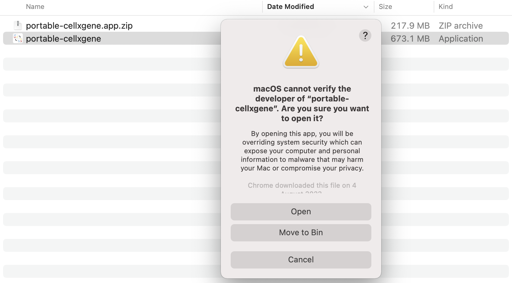
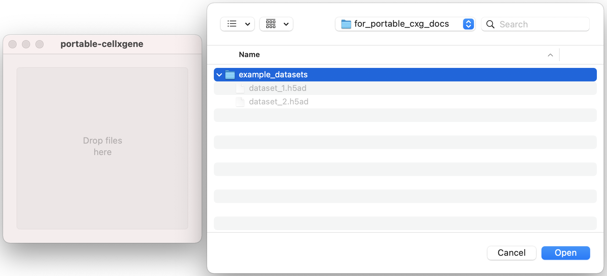

# Portable-CELLxGENE

Portable-CELLxGENE is an executable version of CELLxGENE-gateway to allow
analysis of single-cell data without installing extra software.

## Installation

1. Download the zip file containing the latest release
   (`portable-cellxgene.app.zip`) from
   [here](https://github.com/george-hall-ucl/portable-cellxgene/releases/latest)
   (under "Assets").
   <details>
   <summary>Click for example</summary>
   <kbd></kbd>
   </details>
2. Double click on the downloaded file to extract its contents. It should
   contain a single file: `portable-cellxgene.app`. Move this file to a sensible
   location. You can delete the zip file.
3. Right click on the `.app` file and select "Open". It is likely that an error
   will occur saying that it cannot be opened for security reasons. Click
   "Open" anyway. The operating system should remember that you want to make an
   exception for this app. If you see an error message with no "Open" button,
   click "Cancel" and try to open again via right clicking.
   <details>
   <summary>Click for example</summary>
   <kbd></kbd>
   </details>
4. Portable-CELLxGENE can now be run by double-clicking on the `.app` file. It
   can made discoverable in Launchpad by dragging it into your `Applications`
   folder.


## Running `portable-cellxgene`

1. A drag and drop window will open along with a file browser. Either drag and
   drop the folder containing your `.h5ad` files into the window, or select
   them in the file browser and click "Open".
   <details>
   <summary>Click for example</summary>
   <kbd></kbd>
   </details>
2. A page listing the datasets should open in your browser. If it does not open
   after a minute or two, then navigate to
   [http://127.0.0.1:5005/portable_home.html](http://127.0.0.1:5005/portable_home.html)
   yourself.
3. Follow the instructions on the homepage.
4. Once you are finished, close the `cellxgene` browser tab(s) and quit the
   app.

## Distributing your data

To distribute your data using this app, simply create a folder containing
`.h5ad` files of the datasets of interest. Rendered notebooks can be made
accessible to the user by storing them in a folder named `rendered_notebooks`.
The recipient needs to download the portable-cellxgene app and run it using the
above guide.

### Converting Seurat objects to `.h5ad` files

By default, the `.h5ad` files created by the standard Seurat -> Anndata
conversion process (detailed
[here](https://mojaveazure.github.io/seurat-disk/articles/convert-anndata.html))
contain only the highly variable genes, and therefore other genes cannot be
annotated in `cellxgene`. This can be fixed by replacing the data stored in the
`scale.data` slot of the Seurat object with the entire gene expression matrix.
This object can then be converted to a `.h5ad` file using the guide linked
above. Namely:

```{r}
# For each Seurat object you want to include in portable-cellxgene:
# Assume Seurat object is called "cells"
library(Seurat)
library(SeuratDisk)
cells@assays$RNA@scale.data <- as.matrix(GetAssayData(cells))
SaveH5Seurat(object = cells, filename = "cells.h5Seurat")
Convert(source = "cells.h5Seurat", dest = "h5ad")
```

## How to use `cellxgene`

TODO. Relatively complete guides are available online, e.g.
[here](https://icbi-lab.github.io/cellxgene-user-guide/).

## Licence

Copyright (C) 2023 University College London

This program is free software: you can redistribute it and/or modify
it under the terms of the GNU General Public License as published by
the Free Software Foundation, either version 3 of the License, or
(at your option) any later version.

This program is distributed in the hope that it will be useful,
but WITHOUT ANY WARRANTY; without even the implied warranty of
MERCHANTABILITY or FITNESS FOR A PARTICULAR PURPOSE.  See the
GNU General Public License for more details.

You should have received a copy of the GNU General Public License
along with this program.  If not, see <http://www.gnu.org/licenses/>.
