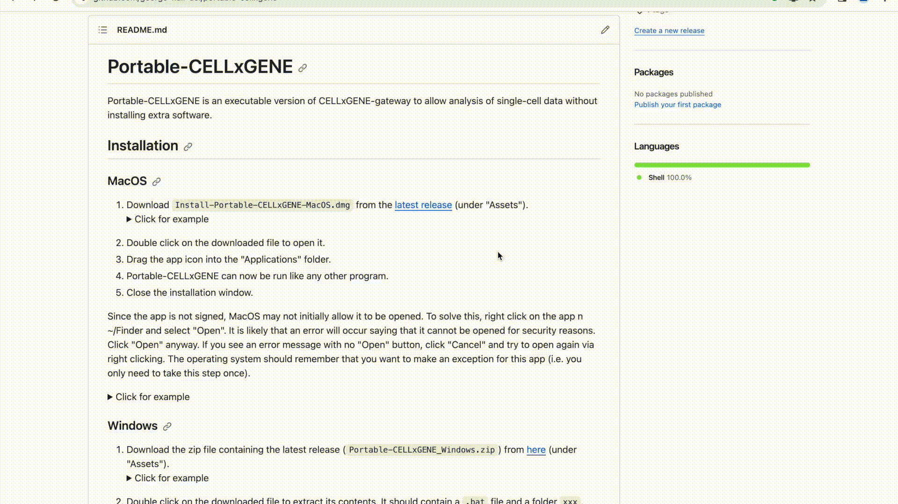
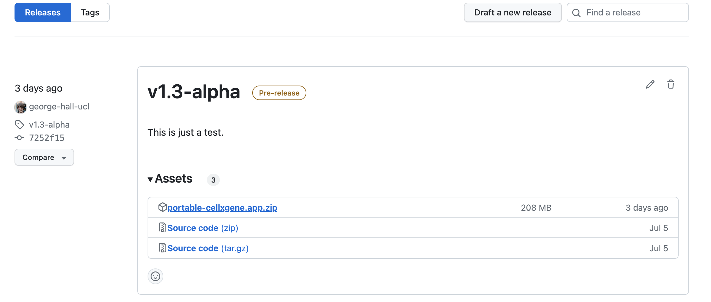

# Portable-CELLxGENE

Portable-CELLxGENE is an executable version of
[CELLxGENE-gateway](https://github.com/Novartis/cellxgene-gateway) to allow
single-cell transcriptomic data to be annotated using
[CELLxGENE](https://github.com/Novartis/cellxgene-gateway) without installing
extra software.

This software is currently in the beta stage of development, meaning that there
may be some issues with installation and usage. Please report any such issues
[here](https://github.com/george-hall-ucl/portable-cellxgene/issues).

## Installation

### MacOS

1. Download `Install-Portable-CELLxGENE-MacOS.dmg` from the [latest release](https://github.com/george-hall-ucl/portable-cellxgene/releases/latest) (under "Assets").
2. Double click on the downloaded file to open it.
3. Drag the app's icon into the `Applications` folder.
4. Portable-CELLxGENE can now be run like any other program.
5. Close the installation window.

<details>
<summary>Click to reveal video of installation process</summary>
<kbd></kbd>
</details>

_Note for users during the beta:_

Since the app is not signed, MacOS may not initially allow it to be opened. To
solve this, right click on the app in Finder (it should be in the
`Applications` folder) and select `Open`. It is likely that an error will occur
saying that it cannot be opened for security reasons.  Click `Open` anyway. If
you see an error message with no `Open` button, click `Cancel` and try to open
again via right clicking. You should only need to do this once.

<details>
<summary>Click to reveal video of this process</summary>
<kbd></kbd>
</details>

### Windows

1. Download the zip file containing the latest release
   (`Portable-CELLxGENE_Windows.zip`) from
   [here](https://github.com/george-hall-ucl/portable-cellxgene/releases/latest)
   (under `Assets`).
   <details>
   <summary>Click for example</summary>
   <kbd></kbd>
   </details>
2. Double click on the downloaded file to extract its contents. It should
   contain a `.bat` file and a folder `xxx`. Move these files to a sensible
   location. You can delete the zip file.

_Note for users during the beta:_

Since the software is not signed, Windows Defender SmartScreen may try to block
its execution. If this happens, you will see a pop-up saying "Windows protected
your PC". Click `More info` and then `Run anyway`. You should only need to do
this once.

## Running Portable-CELLxGENE

<details>
<summary>Click to reveal video of basic Portable-CELLxGENE usage</summary>
<kbd></kbd>
</details>

1. A drag and drop window will open along with a file browser. Either drag and
   drop the folder containing your `.h5ad` files into the window, or select
   them in the file browser and click "Open".
2. A page listing the datasets should open in your browser. If it does not open
   after a minute or two, then navigate to
   [http://127.0.0.1:5005/portable_home.html](http://127.0.0.1:5005/portable_home.html)
   yourself. If the page opened automatically too early, you may need to
   refresh it.
3. Follow the instructions on the homepage.
4. Once you are finished, close the CELLxGENE browser tab(s) and quit the
   app.

Note: Each annotation session will continue running in the background until
either the Portable-CELLxGENE app is terminated or the session is closed from
the "View running sessions" page (see end of above video). For large datasets,
this may slow down your computer so it is advisable to terminate them once you
are finished.

## Distributing your data

To distribute your data using this app, simply create a folder containing
`.h5ad` files of the datasets of interest. Rendered notebooks can be made
accessible to the user by storing them in a folder named `rendered_notebooks`.
The recipient needs to download the Portable-CELLxGENE app and run it using the
above guide.

### Converting Seurat objects to `.h5ad` files

By default, the `.h5ad` files created by the standard Seurat -> Anndata
conversion process (detailed
[here](https://mojaveazure.github.io/seurat-disk/articles/convert-anndata.html))
contain only the highly variable genes, and therefore other genes cannot be
annotated in `CELLxGENE`. This can be fixed by replacing the data stored in the
`scale.data` slot of the Seurat object with the entire gene expression matrix.
This object can then be converted to a `.h5ad` file using the process detailed
in the link above. Putting this together:

```{r}
# For each Seurat object you want to include in Portable-CELLxGENE:
# Assume Seurat object is called "cells"
library(Seurat)
library(SeuratDisk)
cells@assays$RNA@scale.data <- as.matrix(GetAssayData(cells))
SaveH5Seurat(object = cells, filename = "cells.h5Seurat")
Convert(source = "cells.h5Seurat", dest = "h5ad")
```

## How to use CELLxGENE

There are many guides on how to use CELLxGENE available online, for example a
basic introduction can be found
[here](https://icbi-lab.github.io/cellxgene-user-guide/). The official
documentation of CELLxGENE is
[here](https://cellxgene.cziscience.com/docs/01__CellxGene), which gives
in-depth information on its use.

## Licensing

Copyright (C) 2023 University College London

This program is free software: you can redistribute it and/or modify
it under the terms of the GNU General Public License as published by
the Free Software Foundation, either version 3 of the License, or
(at your option) any later version.

This program is distributed in the hope that it will be useful,
but WITHOUT ANY WARRANTY; without even the implied warranty of
MERCHANTABILITY or FITNESS FOR A PARTICULAR PURPOSE.  See the
GNU General Public License for more details.

You should have received a copy of the GNU General Public License
along with this program.  If not, see <http://www.gnu.org/licenses/>.

### Licenses of constituent software

Portable-CELLxGENE contains many other pieces of software. The licensing
information of these constituents can be found at the bottom of the main page
of the dataset browser.

Development of CELLxGENE is funded by the Chan Zuckerberg Initiative.
