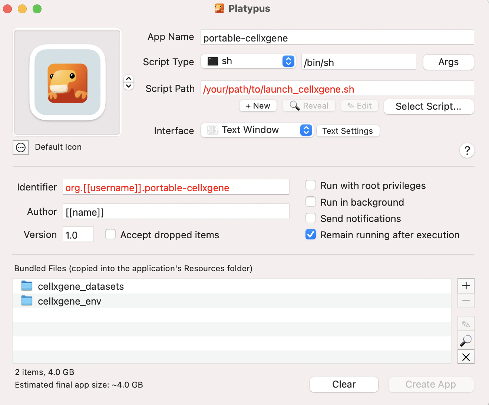

This is a guide to sharing `cellxgene` instances (possibly for multiple
datasets) between MacOS users with minimal effort for the end user.

## How to run `portable-cellxgene`

1. Download `portable-cellxgene.app.zip`.
2. Double click on the downloaded file to extract its contents. It should
   contain a single file: `portable-cellxgene.app`. Move it to a sensible
   location, right click on it and select "Open".
3. Wait for a window to open. Text will print and eventually display the
   message `Running on http://127.0.0.1:5005`. This may take some minutes.
4. A page listing the datasets should open in your browser. If it does not open
   after a minute or two, then navigate to
   `http://127.0.0.1:5005/filecrawl.html` yourself.
5. Click on the name of the dataset that you want to analyse.
6. This will load a page saying that it is loading the dataset. In our
   experience (on a standard MacBook Pro) the loading process takes ~1 minute
   for every 10,000 cells in the dataset.
7. You will eventually be redirected to a screen with a UMAP of the cells. A
   window will pop up asking you to enter a name for a "User Generated Data
   Directory". This is the location where you can save any annotations you
   make. Enter a name here and click "Create user generated data directory".
8. You are now in the main `cellxgene` window. We give a brief introduction to
   this program below. You can navigate back to the dataset selection page with
   your browser's back button. The datasets stay loaded in memory for as long
   as you leave the main app running, so they will load faster the second time
   you load them.
9. Once you are finished, close the `cellxgene` browser tab(s) and click
   "Cancel" and "Quit" on the app window.

## Creating your own `portable-cellxgene` app

Our goal is to create a MacOS app, `portable-cellxgene`, which bundles
the datasets with a Conda environment that does not require
additional installation from the end user. The user will be able to download
and run the app to browse their datasets immediately.

This Conda environment will contain
[`cellxgene`](https://github.com/chanzuckerberg/cellxgene) (from the Chan
Zuckerberg Initiative) and
[`cellxgene-gateway`](https://github.com/Novartis/cellxgene-gateway) (from the
Novartis Institutes for Biomedical Research). Please refer to the relevant
documentation on how to use these programs: this guide is focused on creating
portable instances of them.

We create the MacOS app using [Platypus](https://sveinbjorn.org/platypus).

You can create a portable app of `cellxgene` instances for your own datasets
with the following steps. We assume that you already have Python and Conda
installed.

1. Install Platypus (via its [website](https://sveinbjorn.org/platypus) or with
   `brew install --cask platypus`).
2. Create a Conda environment containing `cellxgene` and `cellxgene-gateway`
   e.g.:
    * 2.1 `conda create --name cellxgene_portable`
    * 2.2 `conda activate cellxgene_portable`
    * 2.3 `pip install cellxgene cellxgene-gateway`
3. Convert it into a portable Conda environment:
    * 3.1 `pip install conda-pack`
    * 3.2 `conda pack --ignore-missing-files -n cellxgene_portable`
    * 3.3 This will create a compressed `tar` file `cellxgene_portable.tar.gz`.
    * 3.4 Extract the contents of this file with `tar -xzvf
      cellxgene_portable.tar.gz` and store in a new directory called
      `cellxgene_portable`. This contains the Python binaries and packages
      necessary to run `cellxgene` and `cellxgene-gateway`.
4. Create a directory called `cellxgene_datasets` that contains all the `.h5ad`
   (i.e. anndata) files you want to include. We discuss below some to consider
   when converting Seurat objects to `.h5ad`.
5. Download the script
   [launch_cellxgene.sh](https://github.com/george-hall-ucl/portable-cellxgene/blob/main/launch_cellxgene.sh).
6. Open Platypus and carry out the following steps (some will be automatic):
    * 6.1 Name the app (we suggest `portable-cellxgene`)
    * 6.2 Ensure "Script Type" is `sh` and that it points to the `sh` binary
      (probably `/bin/sh`).
    * 6.3 Make "Script Path" point to where you saved `launch_cellxgene.sh`.
    * 6.4 Change "Interface" to "Text Window"
    * 6.5 Ensure that "Identifier" is `org.[[username]].portable-cellxgene`,
      where `[[username]]` is replaced by your username.
    * 6.6 Add your name to "Author"
    * 6.7 Add the directories `cellxgene_portable` (the portable Conda
      environment created in Step 3) and `cellxgene_datasets` (created in Step
      4) to "Bundled Files" using the `+` button.
7. After this process, the Platypus window should look similar to the image
   following this list. You should be able to now click "Create App" and select
   where you want to store it.
8. If all has gone to plan, your app is now ready to distribute. It can be use
   according to the guide above.

Following Step 6, your Platypus window should look be similar to this:

  

### Converting Seurat objects to `.h5ad` files

TODO.

## How to use `cellxgene`

TODO. Relatively complete guides are available online, e.g.
[here](https://icbi-lab.github.io/cellxgene-user-guide/).

## Licence

Copyright (C) 2023 University College London

This program is free software: you can redistribute it and/or modify
it under the terms of the GNU General Public License as published by
the Free Software Foundation, either version 3 of the License, or
(at your option) any later version.

This program is distributed in the hope that it will be useful,
but WITHOUT ANY WARRANTY; without even the implied warranty of
MERCHANTABILITY or FITNESS FOR A PARTICULAR PURPOSE.  See the
GNU General Public License for more details.

You should have received a copy of the GNU General Public License
along with this program.  If not, see <http://www.gnu.org/licenses/>.
